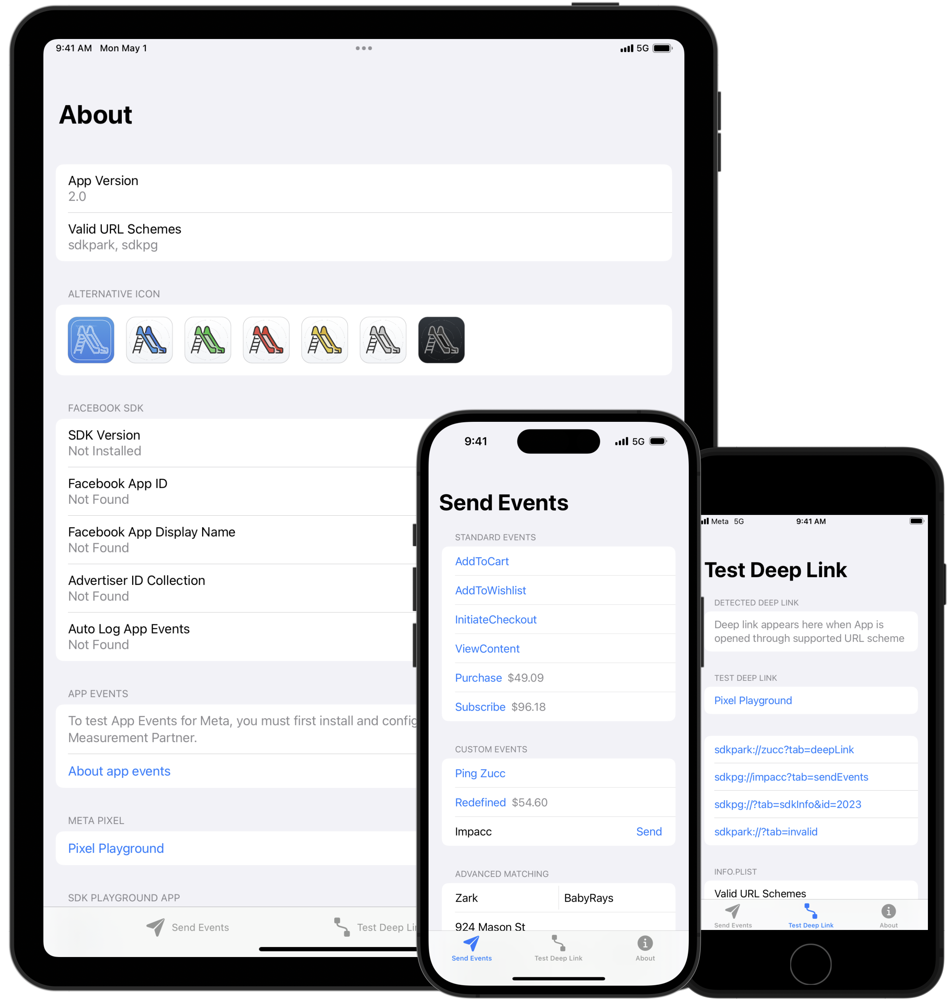

# SDK Playground

## Overview

A demo iOS app to test Facebook and other SDK integrations for app events and deep links.

- Send standard and custom app events
- Test automatic advanced matching
- Test deep link
- Request App Tracking Transparency authorization and status
- Change alternative App icon in app

## Branches

| Branch | State | Bundle Identifier | Default Icon |
|---|---|---|---|
| [main](https://github.com/xtai/sdk-playground/tree/main) | No SDK | `com.seantai.sdk-playground` |  |
| [facebook-sdk](https://github.com/xtai/sdk-playground/tree/facebook-sdk) | [Facebook iOS SDK v16.1.0](https://github.com/facebook/facebook-ios-sdk/releases/tag/v16.1.0) | `com.seantai.sdk-playground.fb` |  |
| [appsflyer-sdk](https://github.com/xtai/sdk-playground/tree/appsflyer-sdk) | [AppsFlyer iOS SDK v6.11.1](https://github.com/AppsFlyerSDK/AppsFlyerFramework/releases/tag/6.11.1) | `com.seantai.sdk-playground.appsflyer` |  |

## Screenshots

